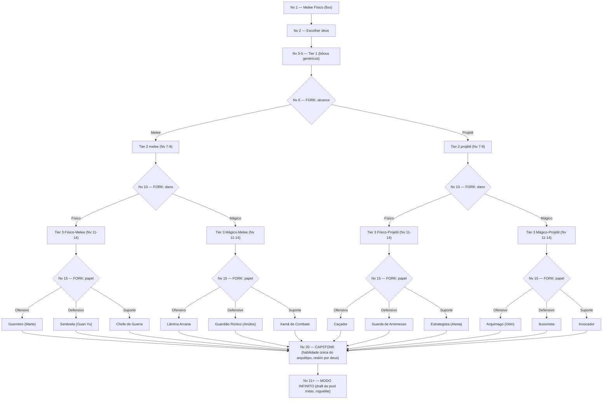

# Sistema de Armas + Skill Tree (nível 1-20, extensível ao infinito)

> Spec de design, aprovada via brainstorming em 18/07/2026 (revisão: suporte a níveis futuros + modo infinito/roguelite, mesma data). Complementa `docs/design/` (a criar futuramente com o GDD completo) — este arquivo cobre especificamente combate, progressão e a tela de visualização da árvore.

## Contexto

O MVP solo já implementado (`GamePage.vue`, `combat.ts`, `useGameStore.ts`, `ClassSelect.vue`, `SkillCard.vue`) usa 100% combate à distância desde o nível 1 (3 modos de tiro: AUTO/MANUAL·MOV/MANUAL·MOUSE). Esta spec **muda isso**: o jogo passa a ter um sistema de armas completo (físico/mágico × melee/projétil × papel), com uma skill tree ramificada até o nível 20, e o nível 1 volta a ser melee físico puro — o sistema de tiro atual só entra em jogo se o jogador escolher um caminho à distância a partir do nível 6.

**Isso exige revisão de código já implementado**, não é só conteúdo novo — ver seção "Impacto no código existente" no fim.

---

## 1. Os 3 eixos de combate

| Eixo | Opções |
|---|---|
| **Dano** | Físico / Mágico |
| **Alcance** | Melee / Projétil |
| **Papel** | Ofensivo / Defensivo / Suporte |

`2 × 2 × 3 = 12 arquétipos-base`. Cada arquétipo tem uma identidade fixa (nome, tema, tipo de habilidade) — **compartilhada por todos os 5 deuses**, que só reskinam nome/ícone/flavor em cima da mesma estrutura mecânica. Isso dá variedade real (60 combinações deus×arquétipo) com esforço de balanceamento de só 12 esqueletos.

### Os 12 arquétipos

| # | Dano | Alcance | Papel | Nome | Tema |
|---|---|---|---|---|---|
| 1 | Físico | Melee | Ofensivo | **Guerreiro** | Dano corpo a corpo cru, combos, crítico |
| 2 | Físico | Melee | Defensivo | **Sentinela** | Tanque corpo a corpo, bloqueio, body-block |
| 3 | Físico | Melee | Suporte | **Chefe de Guerra** | Invoca aliados corpo a corpo, buffs de grupo |
| 4 | Físico | Projétil | Ofensivo | **Caçador** | Dano à distância cru, multi-tiro, penetração |
| 5 | Físico | Projétil | Defensivo | **Guarda de Arremesso** | Escudo arremessável, negação de área física |
| 6 | Físico | Projétil | Suporte | **Estrategista** | Armadilhas físicas, marcação de alvo, debuff |
| 7 | Mágico | Melee | Ofensivo | **Lâmina Arcana** | Arma encantada, explosões de curto alcance |
| 8 | Mágico | Melee | Defensivo | **Guardião Rúnico** | Barreiras mágicas, absorção de dano corpo a corpo |
| 9 | Mágico | Melee | Suporte | **Xamã de Combate** | Cura em área curta, totens, buffs mágicos |
| 10 | Mágico | Projétil | Ofensivo | **Arquimago** | Dano mágico à distância puro (bolas de fogo etc) |
| 11 | Mágico | Projétil | Defensivo | **Ilusionista** | Clones, desvio, controle de área mágico |
| 12 | Mágico | Projétil | Suporte | **Invocador** | Spawna cópias mágicas à distância, cura à distância |

---

## 2. Sistema de Afinidade

Cada um dos 5 deuses já escolhíveis (nível 2) tem uma **afinidade temática** com 1 dos 12 arquétipos — sem travar o jogador nela.

| Deus | Panteão | Movimento (já implementado) | Afinidade | Arquétipo afim |
|---|---|---|---|---|
| Marte | Roma | Nômade entre zonas | Físico · Melee · Ofensivo | Guerreiro |
| Guan Yu | China | Errante na zona | Físico · Melee · Defensivo | Sentinela |
| Atena | Grécia | Nômade entre zonas | Físico · Projétil · Suporte | Estrategista |
| Anúbis | Egito | Errante na zona | Mágico · Melee · Defensivo | Guardião Rúnico |
| Odin | Nórdico | Imóvel | Mágico · Projétil · Ofensivo | Arquimago |

Os outros 7 arquétipos (Chefe de Guerra, Caçador, Guarda de Arremesso, Lâmina Arcana, Xamã de Combate, Ilusionista, Invocador) não são afinidade principal de nenhum deus — qualquer deus pode segui-los, só sem o bônus de afinidade.

**Efeito mecânico:**
- **Build alinhada** (ex: Marte + Guerreiro): **+15% de eficácia** (dano/cura/duração, conforme o tipo de skill) em todas as skills do arquétipo escolhido.
- **Build divergente** (ex: Marte + Invocador): sem penalidade — ganha uma **recompensa de resiliência**, e o jogador escolhe o peso entre duas opções ao longo da árvore (não é fixo, é uma escolha própria dentro dos cards de nível divergente):
  - **Vida máxima extra** (ex: +8% HP máx por nó divergente)
  - **XP bônus** (ex: +8% XP por kill por nó divergente)

  Cards de nível em builds divergentes costumam oferecer 1 opção "Vida" e 1 opção "XP" lado a lado (além da opção temática do arquétipo em si), deixando o jogador inclinar pra sobrevivência ou progressão rápida.

---

## 3. Estrutura da progressão (nível 1 → 20)

```
Nv 1  — Melee Físico fixo (baseline, sem escolha)
Nv 2  — Escolher deus (ClassSelect.vue, já implementado) → trava movimento + define afinidade
Nv 3-5  — Tier 1: 2-3 cards genéricos por nível (bônus % — dano/vida/velocidade)
Nv 6  — FORK: Melee vs Projétil (escolha única, não numérica)
Nv 7-9  — Tier 2: 2-3 cards, já refletindo o alcance escolhido
Nv 10 — FORK: Físico vs Mágico
Nv 11-14 — Tier 3: 2-3 cards, refletindo alcance+dano (já 1 dos 4 quadrantes), habilidades ativas começam a aparecer
Nv 15 — FORK: Ofensivo vs Defensivo vs Suporte → arquétipo completo fechado (1 dos 12)
Nv 16-19 — Tier 4: 2-3 cards totalmente temáticos do arquétipo + bônus de afinidade se alinhado
Nv 20 — CAPSTONE: habilidade única definidora de build (não é escolha entre cards genéricos — é A habilidade do arquétipo, reskinada por deus)
```

Todo nível do 3 ao 19 (exceto os forks 6/10/15) usa `SkillCard.vue` — que já foi construído com layout pronto pra múltiplos cards lado a lado, só precisa passar um array com 2-3 itens em vez de 1. Os forks (6/10/15) e o capstone (20) usam o layout do `ClassSelect.vue` (cards maiores, escolha estrutural) já que são decisões de build, não upgrades incrementais.

### Template por tier (aplica aos 12 arquétipos igualmente)

| Tier | Níveis | Tipo de card | Exemplo genérico |
|---|---|---|---|
| 1 | 3, 4, 5 | Bônus percentual simples, arquétipo-agnóstico | "+12% dano" / "+10% vida máx" / "+8% velocidade de ataque" |
| 2 | 7, 8, 9 | Bônus refletindo o alcance escolhido | Melee: "+alcance de swing" · Projétil: "atravessa 1 inimigo extra" |
| 3 | 11, 12, 13, 14 | Habilidades ativas simples, refletindo quadrante (alcance+dano) | Físico-Melee: sangramento · Mágico-Projétil: queimadura |
| 4 | 16, 17, 18, 19 | Habilidades temáticas do arquétipo completo, afinidade aplicada | Só Guerreiro: "Fúria de Batalha" (combo que aumenta a cada acerto) |

---

## 4. Exemplo completo — Guerreiro (Físico · Melee · Ofensivo), caminho padrão

Esse é o caminho que qualquer jogador segue "sem escolher nada diferente" a partir do baseline do nível 1 — serve de prova de conceito pro template acima. Os outros 11 arquétipos seguem a mesma estrutura de tier, com nomes/efeitos próprios (não escritos nó a nó aqui — fica pra fase de conteúdo/implementação, usando esta tabela como molde).

- **Nv 1:** Melee físico fixo. Alcance curto (raio pequeno ao redor do jogador), ataque automático no inimigo mais próximo dentro do alcance.
- **Nv 2:** Escolher deus. Se **Marte** → afinidade com Guerreiro já ativa desde já (mesmo antes dos forks confirmarem o arquétipo — a afinidade é sobre o RESULTADO final, então só passa a valer de fato a partir do nível 15, mas o jogo pode sinalizar visualmente "no caminho certo" antes disso).
- **Nv 3-5 (Tier 1):** cards tipo "+12% dano" / "+10% vida máx" / "+8% velocidade de ataque" (2-3 opções, jogador escolhe 1 por nível).
- **Nv 6 (FORK):** escolhe **Melee** (mantém o baseline).
- **Nv 7-9 (Tier 2, melee):** "+alcance de swing" / "atordoa por 0.3s ao acertar" / "+15% velocidade de ataque melee".
- **Nv 10 (FORK):** escolhe **Físico**.
- **Nv 11-14 (Tier 3, físico-melee):** habilidades ativas — "Sangramento" (dano ao longo do tempo em acerto crítico), "Investida" (dash curto até o alvo mais próximo), "Golpe Duplo" (chance de atacar 2x), "Quebra-Armadura" (reduz defesa do alvo por alguns segundos).
- **Nv 15 (FORK):** escolhe **Ofensivo** → arquétipo **Guerreiro** fechado.
- **Nv 16-19 (Tier 4, Guerreiro + afinidade se Marte):** "Fúria de Batalha" (cada acerto consecutivo aumenta dano, reseta se errar), "Golpe Sísmico" (dano em área ao redor após combo), "Sede de Sangue" (recupera vida por dano causado), "Grito de Guerra" (buff temporário de dano após matar um inimigo).
- **Nv 20 (CAPSTONE):** **"Fúria de Marte"** (se Marte) / nome equivalente reskinado pros outros 4 deuses — habilidade única: por alguns segundos, todo ataque melee físico causa dano em área e não pode ser interrompido.

---

## 5. Tela de visualização da skill tree (novo requisito)

Pedido explícito: o jogador precisa conseguir **ver a árvore inteira** (todos os 12 arquétipos possíveis, os forks, os tiers) antes/durante o jogo, pra decidir conscientemente qual caminho seguir — não só escolher às cegas nível a nível.

**Formato:** uma nova tela/painel (`SkillTreeMap.vue`), acessível a partir do menu principal ("ver árvore de habilidades", sem precisar estar numa run) e também pausável durante o jogo. Estrutura visual:

- **Eixo vertical = nível** (1 a 20), igual ao diagrama de forks da seção 3.
- **Ramificação visual nos 3 forks** (níveis 6/10/15) — de um tronco único (níveis 1-5) pra 2 ramos (melee/projétil) no nível 6, cada um se abrindo em 2 (físico/mágico) no nível 10, e cada um desses em 3 (ofensivo/defensivo/suporte) no nível 15 → termina nos 12 arquétipos nomeados no topo (nível 20).
- **Estado do nó:** já escolhido (destacado/preenchido) vs disponível vs ainda bloqueado (cinza) — só faz sentido com progresso real de uma run, mas o modo "consulta livre" (fora de uma run, a partir do menu) mostra tudo desbloqueado pra planejamento, sem HP/nível reais.
- **Highlight de afinidade:** ao passar o mouse ou focar num arquétipo, mostrar qual(is) deus(es) tem afinidade com ele (ou nenhum).
- Reaproveita a paleta/tipografia já definida em `tokens.css` (Cinzel pros nomes de arquétipo, cores por deus/panteão já existentes em `gods.ts`).

Esse componente entra como uma task própria na implementação (fora do escopo de combate em si) — é visualização/UX, não afeta a lógica de jogo.

### Diagrama de referência (estrutura dos forks até os 12 arquétipos)



---

## 6. Extensibilidade e modo infinito (nível 21+)

Requisito: dar pra adicionar mais níveis curados no futuro **sem reescrever o motor**, e permitir que uma run continue **indefinidamente** depois do capstone (nível 20) — nesse ponto o jogo vira roguelite de verdade, misturando pedaços de arquétipos diferentes (não só escalando números do arquétipo escolhido).

### Princípio: conteúdo é dado, não código

Toda skill (de qualquer nível, 1 a 20 e além) é um registro numa **tabela de nós** (`SkillNode[]`, em TS/JSON — não hardcoded em componente nenhum). Adicionar/editar skill = editar a tabela, nunca a lógica de `GamePage.vue`/`SkillCard.vue`/`combat.ts`.

```ts
interface SkillNode {
  id: string
  archetypeId: ArquetipoId | 'any'   // 'any' = nó genérico (ex: bônus de tier 1), disponível fora do draft misto também
  tier: 1 | 2 | 3 | 4
  axes: { damage?: 'fisico' | 'magico'; range?: 'melee' | 'projetil'; role?: 'ofensivo' | 'defensivo' | 'suporte' }
  name: string
  description: string
  effect: EffectSpec        // tipo + magnitude + fórmula de escala (não texto solto — precisa ser aplicável em código)
  rarity: 'comum' | 'raro' | 'epico'   // usado só no draft do modo infinito, pra pesar sorteio
}
```

### Definição de nível é separada do conteúdo

```ts
interface LevelDef {
  level: number
  kind: 'fixed' | 'god-select' | 'cards' | 'fork-range' | 'fork-damage' | 'fork-role' | 'capstone' | 'infinite-draft'
  cardCount?: number
}
```

- **Níveis 1-20**: uma tabela `LEVEL_DEFS` explícita (o que já foi desenhado nas seções 1-5). Adicionar um nível curado novo entre eles — ou estender pra, digamos, nível 25 com conteúdo escrito à mão — é só **acrescentar uma linha na tabela**, sem mexer no motor de jogo.
- **Nível 21 em diante**: se `level` não existir em `LEVEL_DEFS`, cai num **fallback automático** — `kind: 'infinite-draft'`. Isso significa que o modo infinito **já funciona sem nenhum conteúdo extra precisar ser escrito** — ele reaproveita a tabela de `SkillNode` inteira que já existe dos níveis 1-20.

### Como funciona o draft infinito (roguelite)

A partir do nível 21, cada level-up sorteia 2-3 `SkillNode` **de qualquer arquétipo** (não só o escolhido no fork do nível 15) — é aqui que vira roguelite de verdade, misturando pedaços de builds diferentes:

- **Peso do sorteio:** nós do arquétipo atual do jogador (e da afinidade do deus) têm peso maior — ainda parece "a build dele", só que com chance real de pegar algo de outro arquétipo pra hibridizar.
- **Repetição empilha:** pegar o mesmo nó de novo aumenta a magnitude dele (mesmo padrão de "upar a mesma carta" usado em jogos do gênero) — evita precisar de conteúdo infinito de verdade, já que o mesmo pool de nós dos 12 arquétipos serve pra sempre, só ficando mais forte.
- **Raridade** (`comum`/`raro`/`epico` no `SkillNode`) controla a frequência de sorteio, não o poder base — dá pra ter picos de sorte sem precisar desenhar tiers 5, 6, 7... à mão.

### Não incluso nesta spec (fica pra quando formos balancear de verdade)

Fórmula exata de escala por repetição, curva de dificuldade das ondas em paralelo ao nível (pra acompanhar um jogador em modo infinito ficando cada vez mais forte), e limite prático de UI pra mostrar "nível 47" sem quebrar o HUD — são ajustes de balanceamento/polish, não mudam a arquitetura acima.

---

## 7. Impacto no código existente (o que precisa mudar)

Isso NÃO é o plano de implementação (isso vem depois, via `EnterPlanMode`) — é só o mapeamento do que já existe e vai precisar de rework, pra não perder de vista na hora de planejar:

- **`combat.ts`** — hoje só tem lógica de tiro à distância (`resolveAttackTarget` com `range` = raio da zona inteira). Precisa de um modo melee (alcance bem menor, sem os 3 fire-modes) como comportamento padrão nível 1, com o sistema de tiro atual passando a ser condicional (só disponível se o jogador escolheu Projétil no fork do nível 6).
- **`player.ts`** — sem mudança estrutural grande, mas o alcance de ataque (hoje fixo em `PLAYER_ZONE.radius`) precisa virar variável conforme melee vs projétil.
- **`useGameStore.ts`** — precisa de campos novos: `weaponRange` ('melee'|'projetil'), `damageType` ('fisico'|'magico'), `role` ('ofensivo'|'defensivo'|'suporte'), array de skills escolhidas (pra aplicar efeitos), e o cálculo de afinidade (alinhado vs divergente) uma vez os 3 forks estiverem resolvidos.
- **`SkillCard.vue`** — já suporta múltiplos cards via `v-for` (hoje só usa 1 hardcoded) — precisa receber a lista de cards dinâmica por nível/tier em vez do card fixo "Fúria de Ares".
- **`ClassSelect.vue`** — o padrão visual (cards grandes, escolha estrutural) é reaproveitado pros 3 forks (níveis 6/10/15) e pro capstone (nível 20), não só pro nível 2.
- **Sistema de XP/nível** — hoje só distingue "nível 2 = classselect, resto = levelup" (`addXp` em `useGameStore.ts`). Precisa virar um resolvedor de `LevelDef` (seção 6) — consulta `LEVEL_DEFS[level]`, e se não existir, cai no fallback `infinite-draft` — em vez de `if/else` de número de nível hardcoded.
- **Novo: `game/skillTree.ts`** (ou `.json`) — a tabela `SkillNode[]` + `LEVEL_DEFS[]` da seção 6. É a fonte única de conteúdo; todo componente de skill lê daqui, nada fica hardcoded no `.vue`.
- **Novo: `game/skillDraft.ts`** — função de sorteio ponderado (usada tanto pros cards normais dos tiers 1-4 quanto pro draft misto do modo infinito), já que os dois reaproveitam a mesma lógica de "sortear N nós do pool, respeitando peso/raridade".
- **`SkillCard.vue`** — já suporta múltiplos cards via `v-for` (hoje só usa 1 hardcoded) — precisa receber a lista de cards dinâmica (gerada por `skillDraft.ts` a partir de `LEVEL_DEFS`/`SkillNode[]`) em vez do card fixo "Fúria de Ares".
- **`ClassSelect.vue`** — o padrão visual (cards grandes, escolha estrutural) é reaproveitado pros 3 forks (níveis 6/10/15) e pro capstone (nível 20), não só pro nível 2.
- **Novo: `SkillTreeMap.vue`** — tela de visualização da árvore completa (seção 5), acessível do menu e em pausa durante o jogo. Lê a mesma tabela `SkillNode[]`/`LEVEL_DEFS[]* — não duplica dado.
- **Conteúdo:** os 12 arquétipos × 4 tiers de cards (~11 cards não-fork por arquétipo) + 12 capstones × 5 reskins de nome/flavor = volume de conteúdo relevante, já nasce como tabela de dados (seção 6), não hardcoded por arquétipo — e é exatamente essa tabela que o modo infinito reaproveita sem precisar de conteúdo extra.
